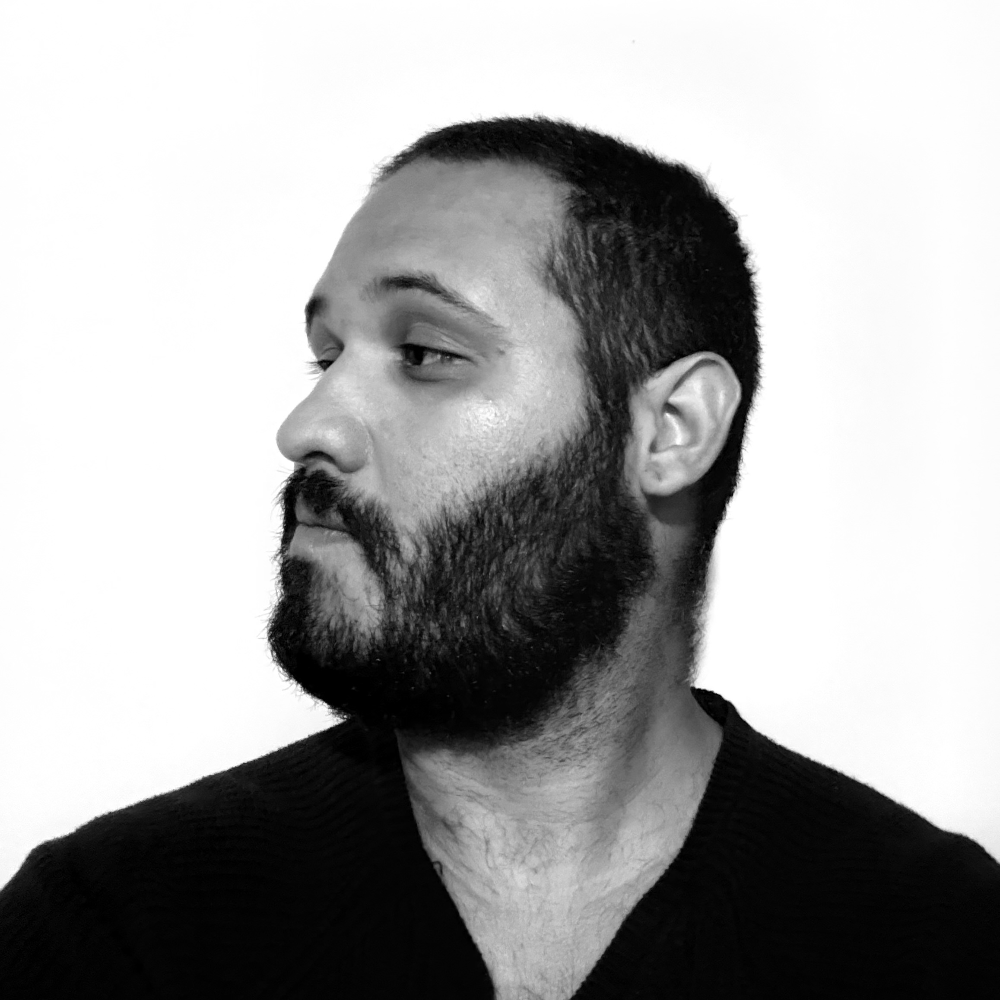

Pesquisador independente baseado em Brasília, Brasil. Bacharel em Comunicação - Audiovisual (Universidade de Brasília - UnB). Interesses de pesquisa incluem sistemas simbólicos pós-seculares, semiótica, teoria cultural, e os mecanismos pelos quais tecnologias de sentido organizam a percepção coletiva. Atualmente desenvolvendo o conceito de "**Purificação Simbólica**": uma matriz para compreender como sistemas simbólicos dominantes sobrescrevem outros enquanto apresentam-se como neutros.

## Bio

 Independent researcher based in Brasília, Brazil. BA in Audiovisual Communication (Universidade de Brasília - UnB). Research interests include post-secular symbolic systems, semiotics, cultural theory, and the mechanisms by which meaning-making technologies organize collective perception. Currently developing the concept of "**Symbolic Purification**": a framework for understanding how dominant symbolic systems overwrite others while presenting themselves as neutral.

## Proficiência:

**Francês (Français)**: Compreendo bem, falo razoavelmente, leio bem, escrevo razoavelmente.

**Inglês (English)**: Compreendo bem, falo bem, leio bem, escrevo razoavelmente.

**Japonês (日本語)**: Compreendo pouco, falo pouco, leio pouco.

**Espanhol (Español)**: Compreendo bem, falo razoavelmente, leio bem, escrevo razoavelmente.

**Grego (Ελληνικά)**: Compreendo pouco, falo pouco, leio pouco.

**Hebraico (השפה העברית)**: Leio pouco.

**Holandês (Nederlandse)**: Compreendo pouco, leio pouco.

**Português**: Compreendo muito bem, falo muito bem, leio muito bem, escrevo bem.